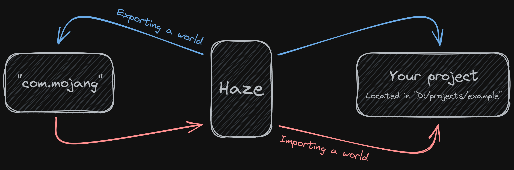

# Haze

> A simple command line tool to manage your Minecraft Bedrock worlds

## Why?

Haze allows you to keep your project's worlds out of the `com.mojang` folder and place them in your project's folder instead. This way you can easily work on multiple worlds and move them back and forth between `com.mojang` and your project's folder.



## Installation

Open PowerShell on Windows and run:

```powershell
irm https://sedge.arexon.me/haze | iex
```
## Usage

Haze requires your project to include a config file that follows the [Project Config Standard](https://github.com/Bedrock-OSS/project-config-standard).

This also means that you can integrate Haze into projects that use [Regolith](https://github.com/Bedrock-OSS/regolith) or [bridge.'s Dash compiler](https://github.com/bridge-core/deno-dash-compiler) seamlessly.

### Setting up worlds

Here is the required config:

```jsonc
{
  "packs": {
    "worldTemplate": "./WT" // could also be "./packs/WT" or "./worlds"
  }
}
```

### Running commands

Run `haze --help` or reference the docs below:

| Command | Description |
| ------- | ----------- |
| `haze test <NAME>` | Copy a world from the project's worlds folder into "minecraftWorlds" |
| `haze save <NAME>` | Copy a world from "minecraftWorlds" into the project's worlds folder |

Note: `<NAME>` is the world folder name.

## License

Haze is under the MIT license.
